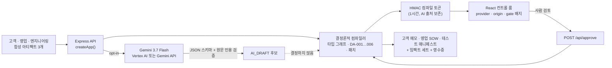

# DeployAlign

**흩어진 배포 약속을 검증 가능한 커밋먼트로 컴파일한다.**

[](https://github.com/chquandogong/deployalign/actions/workflows/ci.yml)
[](https://deployalign-1007800160926.asia-northeast3.run.app)
[](https://ai.google.dev/gemini-api/docs/models)
[](.nvmrc)
[](LICENSE)

🌐 [English](README.md) · **[한국어](README.ko.md)** · [中文](README.zh.md)

---


## 문제

맞춤형 로봇 배포 프로젝트는 서로 일치하지 않는 최소 세 개의 문서 위에서 진행된다.
고객은 *"모든 화학 누출을, 모든 구역에서, 완전 자율로 식별해 달라"*고 쓴다.
영업은 이를 *"Phase 1에서 시설 전체를 커버한다"*로 바꾼다. 엔지니어링은 나중에,
별도의 리뷰에서 *"현재 근거는 다섯 가지 명명된 분석 대상만 커버한다. 핵심 구역 12곳이
매핑됐다. 800 mm 통로 폭은 고객 진술이며 실측되지 않았다. 감독 하의 Phase 1과 파일럿
게이트 전 블라인드 테스트를 권고한다"*고 쓴다.

누구도 거짓말하지 않았다. 그러나 SOW(작업 명세서)에 서명할 시점이면 *모든 물질*은
계약상 약속이 되고, 고객의 사족 보행 플랫폼 *선호*는 *필수 구성*이 되고, 실측되지 않은
통로 폭은 설계 제약이 되어 있다. 배포 엔지니어는 그 괴리를 현장에서 발견하는데, 현장의
한 시간은 리뷰 전체보다 비싸다.

## DeployAlign이 하는 일

DeployAlign은 이 문서들을 컴파일러가 소스 코드를 다루듯 다룬다. 진술들로부터
**타입이 있는 커밋먼트 그래프**를 만들고, 원문 인용을 붙인 **결정론적 진단**을 실행하고,
**근거가 뒷받침하는 최소 범위 패치**를 제안하고, **사람의 검토 경계**에서 멈춘 뒤,
결정이 실제로 건드리는 하류 섹션만 **다시 컴파일**한다 — 고객 결정 메모, 영업 SOW,
엔지니어링 테스트 매니페스트가 모두 같은 결정 ID를 공유한다.

```text
 소스 3개 ──▶ 타입 그래프 ──▶ 진단 6개 ──▶ 3필드 패치 ──▶ 사람 ──▶ 타깃 3개
 고객·영업·     노드 타입 11     DA-001…006    가격/일정/값     검토     메모·SOW·
 엔지니어링     엣지 타입 7      원문 인용      발명 없음        게이트   테스트 매니페스트
```

번들된 시나리오는 **합성(synthetic)**이다: 가상의 서브팹(sub-fab) 라만 검사 파일럿.
고객 기록, 기밀 데이터, 매출, 측정된 현장 결과가 전혀 없으며 UI가 모든 화면에서 이를
명시한다.

### 왜 요약이 아니라 *타입 시스템*인가

일반적인 AI 문서 도구는 요약하거나 다시 쓴다. DeployAlign은 합의 전 진술들을
**의미적으로 구분된 상태로** 유지하여, 하나가 소리 없이 다른 것으로 바뀌지 못하게 한다:

| 문서 속 표현 | 보통 일어나는 일 | DeployAlign의 타입 |
| --- | --- | --- |
| "사족 보행 로봇이면 좋겠다" | SOW의 필수 요건이 된다 | `CustomerPreference` — 영업이 필수로 만들면 경고 (`DA-003`) |
| "시설 전체, 모든 물질 커버" | 인수 기준이 된다 | `EngineeringConstraint`와 `CONFLICTS_WITH`인 `SalesCommitment` — 블로커 `DA-001`, `DA-002` |
| "가장 좁은 통로가 약 800 mm" | 설계 제약이 된다 | `SiteClaim`, 실측 전까지 `OPEN` — 경고 `DA-004` |
| "인수 기준은 성공적인 자율 커버리지" | 그대로 서명된다 | 블로커 `DA-005` — 객관적이고 반복 가능한 기준이 아님 |
| "파일럿 게이트 전 5개 분석 대상 블라인드 테스트" | 킥오프 후 잊힌다 | `DeploymentGate`와 `REQUIRES_TEST`로 연결된 `VerificationTest` — 블로커 `DA-006`이 게이트를 조건부로 유지 |

DeployAlign이 제안하는 패치는 의도적으로 지루하다: *모든 물질 → 명명된 5개 분석 대상*,
*모든 구역 → 매핑된 핵심 AOI 12곳*, *완전 자율 → 감독 하의 Phase 1*. 모든 값은
엔지니어링 근거에서 복사한 것이다. 가격도, 일정도, 임계값도 발명하지 않는다.

### AI가 있는 곳, 없는 곳

Gemini는 **선택적인, 원문 인용 기반 추출 프런트엔드**다. 켜져 있으면 스키마 검증을
거친 후보 진술을 돌려주는데, 반드시 원문을 그대로 인용해야 한다. 근거 없거나 타입이
틀리거나 범위를 벗어난 것은 거부되고 컴파일러는 그것 없이 계속 진행한다. 후보는 별도의
`AI_DRAFT` 노드로 표시된다. **그래프, 6개 진단, 게이트, 패치, 타깃 문서는 결정론적
TypeScript**이며, 범위를 바꾸는 모든 패치는 사람이 승인해야 한다. 영수증(receipt)이
누가 무엇을 했는지 기록한다 — Gemini, 규칙 엔진, 사람 검토자, 빌드 엔진.

0.2.0부터 모든 결과는 **실행 출처(execution origin)**도 함께 가진다: 컴파일러 서비스가
만든 결과는 `API`, API에 도달할 수 없어 페이지가 로컬에서 계산한 결과는 `IN-BROWSER`.
폴백이 서버 실행으로 오해될 수 없다.

## 3분 안에 보기

- 🎬 **데모 영상 (v0.4.0, 3:07):** [youtu.be/3sWnxibKU1Q](https://youtu.be/3sWnxibKU1Q) — 컴파일, 검토, 한국어 자기 문서, CLI. 대본은 [`docs/submission/DEMO_SCRIPT.md`](docs/submission/DEMO_SCRIPT.md), 빌드는 `scripts/demo-video/`의 재현 가능한 파이프라인. 2026-08-17 제출 당시 워크스루(0.1.0)는 [youtu.be/QOPgHHAWOBA](https://youtu.be/QOPgHHAWOBA)에 그대로 있다.
- 🌐 **라이브 데모:** [deployalign-1007800160926.asia-northeast3.run.app](https://deployalign-1007800160926.asia-northeast3.run.app) — Vertex AI를 통한 라이브 **Gemini 3.7 Flash** 추출이 켜진 **0.3.0 빌드**의 공개 Cloud Run 배포(인스턴스 1개, 클라이언트당 10분에 컴파일 6회, 커스텀 모드 꺼짐). 2026-08-26 검증: health가 `model gemini-3.7-flash`를 보고하고 컴파일이 `gemini-vertex` 영수증을 반환했다.

**Run the synthetic case**를 누르고, 6개 진단을 읽고, 패치를 열고, **Simulate approval &
recompile**을 누른 뒤 임팩트 테이블을 비교해 보라: 6개 섹션이 재빌드되고 3개는 변경
지문(fingerprint)이 그대로 유지된다.


2026-08-17에 검증된, 실제 Gemini 영수증이 있는 라이브 0.1.0 배포:


## 자기 문서로 돌려보기 (로컬 모드, 0.3)

공개 데모는 합성 픽스처만 컴파일합니다 — 인증 없는 엔드포인트의 보안 경계입니다. 로컬에서는
플래그 하나로 자기 문서 세 개를 위한 **일반 컴파일 경로**가 열립니다:

```bash
ALLOW_CUSTOM_ARTIFACTS=true pnpm dev
```

히어로에 **Use your own documents** 버튼이 생깁니다. 고객 메모, 영업 제안서, 엔지니어링 리뷰를
붙여 넣으면 컴파일러가 원문 그대로의 절(clause)로 나누고, 역할을 고려한 어휘 규칙으로 각 절의
타입을 정하고, `DA-001`–`DA-006`을 감지기로 실행한 뒤, **모든 대체 값을 엔지니어링 문장에서
복사한** 패치를 제안합니다 — 엔지니어링 텍스트에 한정된 수량이 없으면 패치를 제안하지 않고 그
이유를 근거란에 적습니다. 검토·승인하고 결과를 Markdown 또는 JSON으로 내보낼 수 있습니다.


정직하게 기대할 것:

- 감지기는 **어휘 휴리스틱**입니다(영어, 0.4부터 1차 한국어). 검토자를 위한 후보를 찾아 출처를 인용할 뿐, 무엇도 결정하지 않으며 규칙에 없는 표현은 놓칩니다.
- 게이트는 아무것도 걸리지 않아도 사람이 검토하기 전까지 `HOLD`이며, 절대 무조건 `PASS`가 되지 않습니다.
- 텍스트는 자신의 API 프로세스에만 머무릅니다. 그 프로세스가 `ALLOW_LIVE_GEMINI=true`로도 실행될 때**만** Gemini에 전달됩니다. 공개 배포에서 두 플래그를 함께 켜지 마세요.

## 빌드 단계로 쓰기 (CLI, 0.4)

```bash
pnpm exec deployalign compile ./deployment-docs --out ./deployment-docs/compiled --fail-on blocker
# 파일 이름으로 역할 판별: customer*.md · sales*.md · engineering*.md (또는 고객* · 영업* · 엔지니어링*)
```

이 명령은 게이트, 인용이 붙은 모든 진단, 제안 패치, 판정을 출력하고 `result.json`,
`report.md`, 세 개의 타깃 문서를 쓰며, `--fail-on` 이상 심각도의 미해결 진단이 남아 있으면
종료 코드 **2**로 끝납니다 — 근거를 앞지르는 작업 명세서가 타입 오류처럼 문서 파이프라인을
실패시킵니다. `--approved`는 검토된 베이스라인을 렌더링하고(사람이 명령줄에서 승인했다고
명시하며, 어디에도 기록하지 않음), `--json`은 전체 결과를, `demo`는 번들 픽스처를 컴파일합니다.
CLI는 결정론적 경로만 실행합니다 — 모델도, 네트워크도 없습니다.

```yaml
# .github/workflows/sow-check.yml — 근거를 앞지르는 제안서가 있는 PR을 실패시킨다
- uses: chquandogong/deployalign@v0.5.0
  with:
    path: deployment-docs          # customer*/sales*/engineering* (또는 고객*/영업*/엔지니어링*)
    fail-on: blocker               # blocker | warning | none
# 출력: verdict, gate, blockers, warnings, decision-id, report; report.md가 잡 요약에 붙는다
```

Action 없이 쓰려면: `pnpm dlx github:chquandogong/deployalign#v0.5.0 compile ./deployment-docs --fail-on blocker`.
번들 예제로 먼저 시험해 보세요: [`examples/`](examples/) (`hospital-delivery-robot`은 실패,
`warehouse-amr`은 통과, `sub-fab-raman-ko`는 한국어로 실패).

문서는 **영어 또는 한국어**로 작성할 수 있습니다(1차 어휘 수준 지원; 한계는
[`CHANGELOG.md`](CHANGELOG.md) 참고).

## 아키텍처



| 계층 | 위치 | 담당 |
| --- | --- | --- |
| 도메인 | `src/domain/` | 타입, 정본 픽스처 컴파일러(테스트 14개), frozen 합성 픽스처, 그리고 `general/` — 절 추출, 영어/한국어 어휘 타이핑, 부정어를 인식하는 감지기, 근거 기반 패치, 일반 타깃(코퍼스 5종, 테스트 24개) |
| API | `server/app.ts`, `server/index.ts` | 입력 경계, 픽스처 가드/커스텀 모드, 레이트 리밋, 모드+패치+아티팩트 해시에 묶인 HMAC 토큰, `/api/health`, `/api/compile`, `/api/approve`, 정적 빌드 서빙; 계약 테스트 18개 |
| 모델 어댑터 | `server/gemini.ts` | 선택적 Gemini 호출, 프롬프트, `thinkingConfigFor`, 순수 함수 `validateGeminiPayload`; 테스트 11개 |
| UI | `src/App.tsx`, `src/components/ArtifactEditor.tsx`, `src/lib/exportMarkdown.ts` | 소스, 문서 편집기(커스텀 모드), 그래프 + 노드 인스펙터, 진단, 패치 diff, 승인 경계, 임팩트 테이블, Markdown/JSON 내보내기가 있는 타깃, 소스 맵, 영수증 |
| CLI | `bin/deployalign.mjs`, `cli/main.ts` | `compile`/`demo`, 파일 이름 역할 판별, 출력 파일, `--fail-on` 판정과 종료 코드; 테스트 6개 |
| GitHub Action | `action.yml` | CLI를 감싼 composite 액션: 입력/출력, 잡 요약; CI에서 `examples/`로 셀프테스트 |

상세: [`docs/03-spec/ARCHITECTURE.md`](docs/03-spec/ARCHITECTURE.md) ·
[`docs/03-spec/SPEC.md`](docs/03-spec/SPEC.md).

## 빠른 시작

요구 사항: Node.js 24([`.nvmrc`](.nvmrc); 22.13 이상이면 동작)와 Corepack을 통한 pnpm 11.

```bash
git clone https://github.com/chquandogong/deployalign.git
cd deployalign
corepack enable
pnpm install --frozen-lockfile
pnpm dev
```

<http://localhost:5173>을 열면 된다. Vite가 `/api`를 `:8080`의 Express 서버로 프록시한다.
자격 증명은 필요 없다. 모델 키가 없으면 컴파일러는 결정론적 경로로 실행되고 UI는
`Deterministic fixture fallback · API`로 표시한다.

빌드된 번들을 프로덕션 방식으로 실행하기:

```bash
pnpm build
COMPILE_TOKEN_SECRET="$(openssl rand -base64 48)" NODE_ENV=production pnpm start
# → http://localhost:8080  ·  GET /api/health → {"ok":true,"version":"0.2.0","model":"gemini-3.7-flash",…}
```

### 라이브 Gemini 호출 켜기

`.env.example`을 `.env`로 복사하고 `ALLOW_LIVE_GEMINI=true`를 설정한 뒤 서버 측 자격
증명 경로 **하나**를 고른다. 클라이언트 측 `VITE_*` 변수에는 절대 키를 넣지 않는다.

| 변수 | 기본값 | 용도 |
| --- | --- | --- |
| `ALLOW_LIVE_GEMINI` | `false` | 모델 호출 opt-in; 공개 데모가 조용히 쿼터를 쓰지 못하게 함 |
| `ALLOW_CUSTOM_ARTIFACTS` | `false` | 로컬 모드: 자기 문서 세 개를 일반 컴파일러로 받아들임. 공개 배포에서는 꺼 둘 것 |
| `GEMINI_API_KEY` | — | 경로 A: Gemini Developer API |
| `GOOGLE_CLOUD_PROJECT` / `GOOGLE_CLOUD_LOCATION` | — / `global` | 경로 B: Application Default Credentials를 사용하는 Vertex AI. Gemini 3.x는 `global` 유지 |
| `GEMINI_MODEL` | `gemini-3.7-flash` | 모델 고정. Gemini 2.5 Flash는 Vertex AI 은퇴 일정(2026-10-16)에 올라 있음 |
| `GEMINI_THINKING_LEVEL` | `low` | Gemini 3 전용: `low` / `medium` / `high`; 2.5 고정 시 thinking은 꺼진 채 유지 |
| `COMPILE_TOKEN_SECRET` | 프로세스별 랜덤(개발) | 32바이트 이상, **프로덕션 필수**, 인스턴스 간 공유 |
| `PORT` | `8080` | API/정적 파일 포트 |


## 품질 게이트

```bash
pnpm typecheck   # tsc -b
pnpm lint        # oxlint
pnpm test        # vitest — 7개 스위트, 테스트 75개
pnpm build       # vite 프로덕션 번들
```

CI는 모든 push와 pull request에서 Node 24로 같은 네 단계와 컨테이너 이미지 빌드를
실행한다([`.github/workflows/ci.yml`](.github/workflows/ci.yml), 액션은 SHA로 고정).
테스트는 이 도구를 신뢰할 수 있게 만드는 계약을 보호한다: 모든 인용은 해당 아티팩트의
부분 문자열이고, 게이트는 절대 무조건 통과에 도달하지 않으며, 패치는 정확히 3필드이고,
무관한 섹션은 지문을 유지하며, 변조된 토큰은 거부되고, 픽스처가 아닌 입력은 절대
모델에 도달하지 않는다.

## 컨테이너와 배포

```bash
docker build -t deployalign .
docker run --rm -p 8080:8080 -e COMPILE_TOKEN_SECRET="$(openssl rand -base64 48)" deployalign
```

공개 데모는 이 이미지를 Cloud Run(`asia-northeast3`, 1 CPU / 512 MiB, 최소 0 / 최대 1
인스턴스)에서 전용 런타임 서비스 계정, Secret Manager의 토큰 시크릿, Vertex AI 활성화
상태로 실행한다. 레이트 리미터와 검토 상태가 프로세스 로컬이므로 인스턴스를 1개로
제한한다 — 의도된 프로토타입 경계이며 확장성 주장이 아니다. 운영, 검증 절차, 모델
마이그레이션 절차는 [`docs/05-ops/RUNBOOK.md`](docs/05-ops/RUNBOOK.md)에 있다.

## 안전 경계

- 생성된 문서는 사람이 시맨틱 패치를 승인하기 전까지 **초안**이다. 데모의 승인 버튼은 그 경계를 보여주는 것이며 인증된 승인이 아니다.
- Gemini는 측정값, 비용, 일정, 물리적 실현 가능성, 안전 인증을 **발명할 수 없고**, 게이트를 진행시킬 수 없다.
- 모델이 반환한 원문 인용은 아티팩트와 **정확히** 일치해야 하며 아니면 거부된다.
- 공개 프로토타입은 **공개된 합성 픽스처만** 컴파일한다. 개수, 메타데이터, 내용의 어떤 변경도 모델 호출 전에 거부된다. 커스텀 모드는 로컬 전용 플래그이며 공개 데모에서는 절대 켜지 않는다.
- 컴파일 토큰은 서명되지만 암호화되지 않는다. 레이트 리밋은 인메모리다. 지문은 `fnv1a32` 변경 감지기이며 무결성 해시가 아니다. [`SECURITY.md`](SECURITY.md)와 [`docs/04-quality/RISK_REGISTER.md`](docs/04-quality/RISK_REGISTER.md) 참고.
- DeployAlign은 로봇을 제어하지 않으며 화학 물질 검출이나 시설 접근을 인증하지 않는다.

## 로드맵 — 실제로 쓰이는 도구를 향해

메커니즘은 합성 케이스 하나에서 증명됐다. "쓸모 있다"는 것은 배포 엔지니어가 **자기
자신의** 세 문서에 이 도구를 돌리고 그 결과로 행동할 수 있다는 뜻이다. 성공·중단
기준이 붙은 다음 단계들은 [`docs/00-overview/ROADMAP.md`](docs/00-overview/ROADMAP.md)에 있다:

1. ~~**0.3 — 자기 아티팩트 가져오기(로컬 모드).**~~ 0.3.0에서 출시: 결정론적 일반 컴파일러, 감지기 6개, 근거 원문 기반 패치, Markdown/JSON 내보내기, 로컬 전용 플래그(D-016).
2. ~~**0.4 — CLI와 CI 모드.**~~ 0.4.0에서 출시: `deployalign compile … --fail-on blocker`, 문서 파이프라인용 출력, 1차 한국어 지원.
3. **0.5 — 실무자 파일럿.** 키트는 준비됨([`docs/05-ops/PILOT_KIT.md`](docs/05-ops/PILOT_KIT.md): 세션 계획, 비식별화 규칙, 지표, 오탐→코퍼스 루프); 인터뷰 자체가 다음 사람의 일이다. 그 결과가 신원, 영속성, 감사 기능을 만들 가치가 있는지를 결정한다.

이슈와 풀 리퀘스트를 환영한다. [`CONTRIBUTING.md`](CONTRIBUTING.md) 참고.

## 프로젝트 상태와 출발점

DeployAlign은 **Build with Gemini XPRIZE**를 위해 만들어져 2026-08-17에 제출됐다
([Devpost 엔트리](https://devpost.com/software/test-q0h69v)). 그 제출은 체크포인트
(`v0.1.0`)이지 결승선이 아니다. 프로젝트는 공개적으로 계속되며, 변경은
[`CHANGELOG.md`](CHANGELOG.md)에, 그 이유는
[`docs/02-decisions/DECISION_LOG.md`](docs/02-decisions/DECISION_LOG.md)에 기록한다.

0.5.0 기준의 정직한 범위: 결정론적 컴파일러(픽스처·일반), API, UI, CLI, GitHub Action, 테스트 75개가
구현되어 로컬에서 검증됐고, 커스텀 문서 흐름은 헤드리스 브라우저로, Action은 CI에서 예제 세트로 확인했다. 공개 데모는 0.3.0 빌드에서
`gemini-3.7-flash` 라이브 호출이 **실제로 검증**됐다(2026-08-26). 라이브 `gemini-2.5-flash` 호출은 배포된 0.1.0 리비전에서 검증됐다.
`gemini-3.7-flash` 기본값은 단위 테스트를 통과했고 첫 라이브 영수증을 기다린다.
프로덕션 배포, 고객, 측정된 현장 결과는 없다. 여기 있는 어떤 것도 참가 자격, 수상,
사업성을 입증하지 않는다.

## 문서

| 문서 | 목적 |
| --- | --- |
| [`docs/00-overview/DASHBOARD.md`](docs/00-overview/DASHBOARD.md) | 현재 상태, 작업 보드, 소유자 결정 대기 항목 |
| [`docs/00-overview/ROADMAP.md`](docs/00-overview/ROADMAP.md) | "쓸모 있음"의 정의와 거기까지의 단계 |
| [`docs/03-spec/SPEC.md`](docs/03-spec/SPEC.md) | 기능 요구사항 FR-01…FR-34와 인수 기준 |
| [`docs/03-spec/ARCHITECTURE.md`](docs/03-spec/ARCHITECTURE.md) | 컴포넌트, 데이터 흐름, 신뢰 경계, 실패 모드 |
| [`docs/04-quality/TEST_PLAN.md`](docs/04-quality/TEST_PLAN.md) · [`RISK_REGISTER.md`](docs/04-quality/RISK_REGISTER.md) | 테스트 계획과 상태가 표시된 리스크 |
| [`docs/05-ops/RUNBOOK.md`](docs/05-ops/RUNBOOK.md) | 실행, 검증, 모델 마이그레이션, 문제 해결, 롤백 |
| [`docs/05-ops/PILOT_KIT.md`](docs/05-ops/PILOT_KIT.md) | 근거를 지어내지 않고 실무자 5명 파일럿을 진행하는 방법 |
| [`docs/02-decisions/DECISION_LOG.md`](docs/02-decisions/DECISION_LOG.md) | D-001…D-022 |
| [`docs/submission/`](docs/submission/) | 데모 대본, YouTube 메타데이터, Devpost 증거의 역사 기록 |

## 라이선스

MIT — [`LICENSE`](LICENSE) 참고. 브라우저 번들의 제3자 고지는
[`/third-party-licenses.txt`](https://deployalign-1007800160926.asia-northeast3.run.app/third-party-licenses.txt)에서 제공된다.
