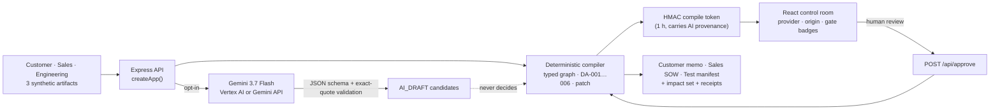

# DeployAlign

**Compile scattered deployment promises into testable commitments.**

[](https://github.com/chquandogong/deployalign/actions/workflows/ci.yml)
[](https://deployalign-1007800160926.asia-northeast3.run.app)
[](https://ai.google.dev/gemini-api/docs/models)
[](.nvmrc)
[](LICENSE)

🌐 **[English](README.md)** · [한국어](README.ko.md) · [中文](README.zh.md)

---


## The problem

A bespoke robotics deployment lives in at least three documents that never agree.
The customer writes *"identify all chemical leaks in every area, fully autonomously."*
Sales turns that into *"Phase 1 will cover the entire facility."* Engineering, later
and in a separate review, writes *"current evidence covers five named analytes; twelve
critical areas are mapped; the 800 mm aisle is customer-reported, not surveyed;
recommend supervised Phase 1 and a blind test before any pilot gate."*

Nobody lied. But by the time the statement of work is signed, *all materials* has
become a contractual promise, a customer's *preference* for a quadruped platform has
become a *mandatory configuration*, and an unsurveyed aisle width has become a design
constraint. The deployment engineer discovers the drift in the field, where an hour
costs more than the whole review would have.

## What DeployAlign does

DeployAlign treats those documents the way a compiler treats source code. It builds a
**typed commitment graph** from the statements, runs **deterministic diagnostics** with
exact source quotes, proposes the **smallest evidence-supported scope patch**, stops at
a **human review boundary**, and then **recompiles only the downstream sections** the
decision actually touches — a customer decision memo, a sales SOW, an engineering test
manifest — all carrying the same decision ID.

```text
 3 source artifacts ──▶ typed graph ──▶ 6 diagnostics ──▶ 3-field patch ──▶ HUMAN ──▶ 3 targets
 customer · sales ·      11 node types    DA-001…DA-006     no invented       review    memo · SOW ·
 engineering             7 edge types     exact quotes      price/date/value  gate      test manifest
```

The bundled scenario is **synthetic**: a fictional sub-fab Raman inspection pilot. It
contains no customer records, no confidential data, no revenue and no measured field
outcome, and the UI says so on every screen.

### Why a *type system* and not a summary

Generic AI document tools summarise or rewrite. DeployAlign keeps pre-agreement
statements **semantically distinct** so that one cannot silently become another:

| In the documents | What usually happens | How DeployAlign types it |
| --- | --- | --- |
| "We'd like a four-legged robot" | becomes a hard requirement in the SOW | `CustomerPreference` — a warning (`DA-003`) if sales makes it mandatory |
| "Cover the entire facility, any material" | becomes the acceptance criterion | `SalesCommitment` that `CONFLICTS_WITH` the `EngineeringConstraint` — blocker `DA-001`, `DA-002` |
| "The narrowest aisle is about 800 mm" | becomes a design constraint | `SiteClaim`, status `OPEN` until surveyed — warning `DA-004` |
| "Acceptance is successful autonomous coverage" | signed as-is | blocker `DA-005` — not an objective, repeatable criterion |
| "Blind five-analyte test before any pilot gate" | forgotten after kickoff | `VerificationTest` that `REQUIRES_TEST`-links the `DeploymentGate` — blocker `DA-006` keeps the gate conditional |

The patch DeployAlign proposes is deliberately boring: *all materials → five named
analytes*, *every area → 12 mapped critical AOIs*, *fully autonomous → supervised
Phase 1*. Every value is copied from the engineering evidence. Nothing is invented — no
price, no schedule, no threshold.

### Where the AI is, and where it is not

Gemini is an **optional, exact-quote extraction front end**. When enabled, it returns
schema-validated candidate statements that must quote the source verbatim; anything
ungrounded, mistyped or out of range is rejected and the compiler continues without
it. The candidates appear as separate `AI_DRAFT` nodes. **The graph, the six
diagnostics, the gate, the patch and the target documents are deterministic
TypeScript**, and a person must approve every scope-changing patch. Receipts record
which actor did what — Gemini, the rule engine, the human reviewer, the build engine.

Since 0.2.0 every result also carries an **execution origin**: `API` when the compiler
service produced it, `IN-BROWSER` when the page computed it locally because the API was
unreachable. A fallback can no longer pass for a server run.

## See it in three minutes

- 🎬 **Demo video:** [youtu.be/QOPgHHAWOBA](https://youtu.be/QOPgHHAWOBA) — the 2026-08-17 walkthrough (0.1.0). A 0.2.0 walkthrough is scripted in [`docs/submission/DEMO_SCRIPT.md`](docs/submission/DEMO_SCRIPT.md) and built with the reproducible pipeline described there.
- 🌐 **Live demo:** [deployalign-1007800160926.asia-northeast3.run.app](https://deployalign-1007800160926.asia-northeast3.run.app) — public Cloud Run deployment of the **0.3.0 build** with live **Gemini 3.7 Flash** extraction through Vertex AI (one instance, six compiles per ten minutes per client; custom mode disabled). Verified 2026-08-26: health reports `model gemini-3.7-flash` and a compile returned a `gemini-vertex` receipt.

Click **Run the synthetic case**, read the six diagnostics, open the patch, press
**Simulate approval & recompile**, and compare the impact table: six sections rebuilt,
three untouched with their change fingerprints intact.


The live 0.1.0 deployment with real Gemini receipts, as verified on 2026-08-17:


## Run it on your own documents (local mode, 0.3)

The public demo compiles only the synthetic fixture — that guard is a security boundary
for an unauthenticated endpoint. Locally, one flag opens a **general compile path** for
your own three documents:

```bash
ALLOW_CUSTOM_ARTIFACTS=true pnpm dev
```

The hero gains a **Use your own documents** button. Paste a customer note, a sales
proposal and an engineering review; the compiler splits them into verbatim clauses, types
each clause with role-aware lexical rules, runs `DA-001`–`DA-006` as detectors, and
proposes a patch whose every replacement value is **copied from an engineering
statement** — if the engineering text names no bounded quantity, no patch is proposed and
the rationale says so. Review, approve, and export the result as Markdown or JSON.


What to expect, honestly:

- The detectors are **lexical heuristics** (English, plus first-pass Korean since 0.4). They find candidates for a reviewer and quote their source; they do not decide anything and will miss phrasing they were not written for.
- The gate stays `HOLD` until a person reviews, even when nothing fires, and never becomes an unconditional `PASS`.
- Your text stays with your own API process. It reaches Gemini **only** if that process also runs with `ALLOW_LIVE_GEMINI=true`; never enable both on a public deployment.

## Use it as a build step (CLI, 0.4)

```bash
pnpm exec deployalign compile ./deployment-docs --out ./deployment-docs/compiled --fail-on blocker
# roles from file names: customer*.md · sales*.md · engineering*.md (or 고객* · 영업* · 엔지니어링*)
```

The command prints the gate, every diagnostic with its quote, the proposed patch and a
verdict, writes `result.json`, `report.md` and the three target documents, and exits
**2** when unresolved diagnostics remain at or above `--fail-on` — so a statement of work
that outruns engineering evidence fails the docs pipeline the way a type error fails a
build. `--approved` renders the reviewed baseline (and says a person approved on the
command line; nothing is recorded), `--json` emits the full result, `demo` compiles the
bundled fixture. The CLI runs the deterministic path only — no model, no network.

```yaml
# .github/workflows/sow-check.yml — fail a PR whose proposal outruns the evidence
- run: pnpm dlx github:chquandogong/deployalign compile ./deployment-docs --fail-on blocker
```

Documents may be **English or Korean** (first-pass lexical support; see the limits in
[`CHANGELOG.md`](CHANGELOG.md)).

## Architecture



| Layer | Where | What it owns |
| --- | --- | --- |
| Domain | `src/domain/` | Types, the canonical fixture compiler (14 tests), the frozen synthetic fixture, and `general/` — clause extraction, English/Korean lexical typing, detectors, evidence-derived patch, generic targets (21 tests across three corpora) |
| API | `server/app.ts`, `server/index.ts` | Input bounds, fixture guard / custom mode, rate limit, HMAC tokens bound to mode + patch + artifact hash, `/api/health`, `/api/compile`, `/api/approve`, static build; 18 contract tests |
| Model adapter | `server/gemini.ts` | Opt-in Gemini call, prompt, `thinkingConfigFor`, pure `validateGeminiPayload`; 11 tests |
| UI | `src/App.tsx`, `src/components/ArtifactEditor.tsx`, `src/lib/exportMarkdown.ts` | Sources, document editor (custom mode), graph + node inspector, diagnostics, patch diff, approval boundary, impact table, targets with Markdown/JSON export, source map, receipts |
| CLI | `bin/deployalign.mjs`, `cli/main.ts` | `compile`/`demo`, file-name roles, outputs, `--fail-on` verdict and exit codes; 6 tests |

Details: [`docs/03-spec/ARCHITECTURE.md`](docs/03-spec/ARCHITECTURE.md) ·
[`docs/03-spec/SPEC.md`](docs/03-spec/SPEC.md).

## Quick start

Requirements: Node.js 24 ([`.nvmrc`](.nvmrc); ≥ 22.13 works) and pnpm 11 via Corepack.

```bash
git clone https://github.com/chquandogong/deployalign.git
cd deployalign
corepack enable
pnpm install --frozen-lockfile
pnpm dev
```

Open <http://localhost:5173>. Vite proxies `/api` to the Express server on `:8080`.
No credentials are needed: without a model key the compiler runs the deterministic path
and the UI labels it `Deterministic fixture fallback · API`.

Production-style run of the built bundle:

```bash
pnpm build
COMPILE_TOKEN_SECRET="$(openssl rand -base64 48)" NODE_ENV=production pnpm start
# → http://localhost:8080  ·  GET /api/health → {"ok":true,"version":"0.2.0","model":"gemini-3.7-flash",…}
```

### Enable a live Gemini call

Copy `.env.example` to `.env`, set `ALLOW_LIVE_GEMINI=true`, and choose **one**
server-side credential path. Never put a key in a client-side `VITE_*` variable.

| Variable | Default | Purpose |
| --- | --- | --- |
| `ALLOW_LIVE_GEMINI` | `false` | Opt in to model calls; the public demo cannot spend quota silently |
| `ALLOW_CUSTOM_ARTIFACTS` | `false` | Local mode: accept your own three documents through the general compiler. Keep it off on public deployments |
| `GEMINI_API_KEY` | — | Path A: Gemini Developer API |
| `GOOGLE_CLOUD_PROJECT` / `GOOGLE_CLOUD_LOCATION` | — / `global` | Path B: Vertex AI with Application Default Credentials. Keep `global` for Gemini 3.x |
| `GEMINI_MODEL` | `gemini-3.7-flash` | Pin any model. Gemini 2.5 Flash is on a Vertex AI retirement track (2026-10-16) |
| `GEMINI_THINKING_LEVEL` | `low` | Gemini 3 only: `low` / `medium` / `high`; 2.5 pins keep thinking off |
| `COMPILE_TOKEN_SECRET` | random per process (dev) | ≥ 32 bytes, **required in production**, shared across instances |
| `PORT` | `8080` | API/static port |

> `.env.example` still shows `GEMINI_MODEL=gemini-2.5-flash` from 0.1.0 — delete or
> update that line, or the pin overrides the new default.

## Quality gates

```bash
pnpm typecheck   # tsc -b
pnpm lint        # oxlint
pnpm test        # vitest — 72 tests in 7 suites
pnpm build       # vite production bundle
```

CI runs the same four steps on Node 24 plus a container-image build on every push and
pull request ([`.github/workflows/ci.yml`](.github/workflows/ci.yml), actions pinned by
SHA). The tests protect the contract that makes the tool trustworthy: every quote is a
substring of its artifact, the gate never reaches an unconditional pass, the patch has
exactly three fields, unrelated sections keep their fingerprints, tampered tokens are
refused, and non-fixture input never reaches the model.

## Container and deployment

```bash
docker build -t deployalign .
docker run --rm -p 8080:8080 -e COMPILE_TOKEN_SECRET="$(openssl rand -base64 48)" deployalign
```

The public demo runs this image on Cloud Run (`asia-northeast3`, 1 CPU / 512 MiB,
min 0 / max 1 instance) with a dedicated runtime service account, the token secret in
Secret Manager and Vertex AI enabled. It is capped at one instance because the rate
limiter and review state are process-local — a deliberate prototype boundary, not a
scalability claim. Operations, verification steps and the model-migration procedure are
in [`docs/05-ops/RUNBOOK.md`](docs/05-ops/RUNBOOK.md).

## Safety boundaries

- Generated documents are **drafts** until a person approves the semantic patch; the demo's approve button illustrates that boundary and is not authenticated approval.
- Gemini **cannot invent** measurements, cost, schedule, physical feasibility or safety certification, and cannot advance the gate.
- Source quotes returned by the model must match the artifact **exactly** or are rejected.
- The public prototype compiles **only the disclosed synthetic fixture**; any change to count, metadata or content is refused before the model is called. Custom mode is a local-only flag and is never enabled on the public demo.
- The compile token is signed, not encrypted; the rate limit is in-memory; fingerprints are `fnv1a32` change detectors, not integrity hashes. See [`SECURITY.md`](SECURITY.md) and [`docs/04-quality/RISK_REGISTER.md`](docs/04-quality/RISK_REGISTER.md).
- DeployAlign does not control a robot and does not certify chemical detection or facility access.

## Roadmap — toward a tool people actually use

The mechanism is proven on one synthetic case. "Useful" means a deployment engineer
can run it on **their own** three documents and act on the result. The next steps, each
with success and stop criteria, are in [`docs/00-overview/ROADMAP.md`](docs/00-overview/ROADMAP.md):

1. ~~**0.3 — Bring your own artifacts (local mode).**~~ Shipped in 0.3.0: deterministic general compiler, six detectors, verbatim-evidence patch, Markdown/JSON export, local-only flag (D-016).
2. ~~**0.4 — CLI and CI mode.**~~ Shipped in 0.4.0: `deployalign compile … --fail-on blocker`, outputs for docs pipelines, first-pass Korean.
3. **0.5 — Practitioner pilot.** Five interviews, redacted samples, measured precision and time-to-decision — the only thing that decides whether identity, persistence and audit are worth building.

Issues and pull requests are welcome; see [`CONTRIBUTING.md`](CONTRIBUTING.md).

## Project status and origin

DeployAlign was built for **Build with Gemini XPRIZE** and submitted on 2026-08-17
([Devpost entry](https://devpost.com/software/test-q0h69v)). That submission is a
checkpoint (`v0.1.0`), not the finish line. The project continues in the open; changes
are recorded in [`CHANGELOG.md`](CHANGELOG.md) and the reasoning behind them in
[`docs/02-decisions/DECISION_LOG.md`](docs/02-decisions/DECISION_LOG.md).

Honest scope, as of 0.4.0: the deterministic compilers (fixture and general), API, UI, CLI
and 72 tests are implemented and verified locally, including a headless-browser run of
the custom-document flow; the public demo runs the 0.3.0 build with a **live-verified**
`gemini-3.7-flash` call (2026-08-26); there is still no production deployment, no
customer, and no measured field outcome. Nothing here establishes eligibility, an award or business viability.

## Documentation

| Document | Purpose |
| --- | --- |
| [`docs/00-overview/DASHBOARD.md`](docs/00-overview/DASHBOARD.md) | Current state, work board, decisions waiting on the owner |
| [`docs/00-overview/ROADMAP.md`](docs/00-overview/ROADMAP.md) | What "useful" means and the phases to get there |
| [`docs/03-spec/SPEC.md`](docs/03-spec/SPEC.md) | Functional requirements FR-01…FR-31 and acceptance criteria |
| [`docs/03-spec/ARCHITECTURE.md`](docs/03-spec/ARCHITECTURE.md) | Components, data flow, trust boundaries, failure modes |
| [`docs/04-quality/TEST_PLAN.md`](docs/04-quality/TEST_PLAN.md) · [`RISK_REGISTER.md`](docs/04-quality/RISK_REGISTER.md) | Test plan and risks with state |
| [`docs/05-ops/RUNBOOK.md`](docs/05-ops/RUNBOOK.md) | Run, verify, migrate the model, troubleshoot, roll back |
| [`docs/02-decisions/DECISION_LOG.md`](docs/02-decisions/DECISION_LOG.md) | D-001…D-018 and the owner decision queue |
| [`docs/submission/`](docs/submission/) | Demo script, YouTube metadata, and the historical Devpost evidence record |

## License

MIT — see [`LICENSE`](LICENSE). Browser-bundle third-party notices are served at
[`/third-party-licenses.txt`](https://deployalign-1007800160926.asia-northeast3.run.app/third-party-licenses.txt).
