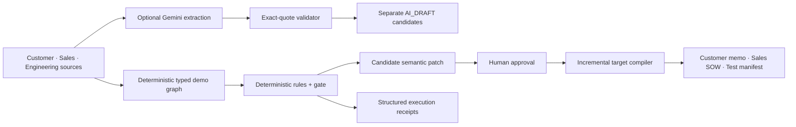

# DeployAlign

> Compile scattered promises into testable deployment commitments.


DeployAlign is an evidence-gated, typed decision compiler for bespoke robotics deployments. It turns a customer email, a draft sales proposal, and an engineering review into a source-mapped `Deployment Commitment Graph`, applies deterministic domain checks, proposes the smallest reviewable scope patch, and recompiles only the affected deliverable sections after human approval.

The included scenario is synthetic: a sub-fab Raman inspection pilot. It contains no customer records, confidential company data, real revenue, or measured field outcomes.

## Why this is different

Generic AI document tools can summarize or rewrite a proposal. DeployAlign keeps pre-agreement statements semantically distinct:

- `CustomerPreference` is not silently promoted to `EngineeringConstraint`.
- `SalesCommitment` cannot outrun accepted `Evidence` without a blocker.
- a verbal `SiteClaim` is not treated as a surveyed fact.
- an open `VerificationTest` prevents an unconditional deployment gate.
- all affected outputs share a stable Decision ID and source map.

Gemini is an optional, exact-quote candidate extractor. Its validated statements remain separate `AI_DRAFT` nodes. The fixed demo's canonical graph, TypeScript checks, gate transition, patch, and non-cryptographic FNV-1a32 section fingerprints are deterministic. A human must approve every scope-changing patch.

## Demo flow

1. Ingest three synthetic artifacts.
2. Compile atomic statements into typed nodes with source quotes.
3. Emit six domain diagnostics (`DA-001`–`DA-006`).
4. Review a three-field minimum scope patch:
   - all materials → five named analytes
   - every area → 12 mapped critical AOIs
   - fully autonomous → supervised Phase 1
5. Approve the patch as a human reviewer.
6. Advance `HOLD` → `CONDITIONAL PILOT` while critical tests remain open.
7. Recompile six affected sections and preserve three unrelated FNV-1a32 fingerprints.

## Architecture



The production container is designed for Cloud Run. JSON logs written to stdout are captured by Cloud Logging. Live Gemini calls are opt-in and protected by a per-instance demo limiter; a public demo must additionally cap Cloud Run at one instance and use project/model quotas. The UI falls back to a clearly marked deterministic demo when credentials are unavailable.

## Run locally

Requirements: Node.js 24+, pnpm 11+.

```bash
pnpm install
pnpm dev
```

Open `http://localhost:5173`. The API listens on port `8080`.

### Enable a live Gemini call

Copy `.env.example` to `.env`, set `ALLOW_LIVE_GEMINI=true`, then choose one server-side authentication path:

- Gemini Developer API: set `GEMINI_API_KEY`.
- Vertex AI: set `GOOGLE_CLOUD_PROJECT` and `GOOGLE_CLOUD_LOCATION`, and provide Application Default Credentials.

Never expose the key in client-side `VITE_*` variables.

## Quality gates

```bash
pnpm typecheck
pnpm lint
pnpm test
pnpm build
```

The 13 deterministic tests verify blocker determinism, source-map grounding, strict fixture isolation, patch minimality, the human approval boundary, conditional gate safety, selective recompilation, preserved FNV-1a32 fingerprints, and stable Decision IDs.

## Container

```bash
docker build -t deployalign .
docker run --rm -p 8080:8080 deployalign
```

For Cloud Run, deploy the container or use source deployment, set `ALLOW_LIVE_GEMINI=true`, store a shared `COMPILE_TOKEN_SECRET` of at least 32 bytes in Secret Manager, cap the prototype at one instance, and bind the minimum required service-account permissions. The service intentionally refuses to start in production without that stable secret. Do not claim a production Gemini or Google Cloud deployment until the deployed URL, model call, Cloud Logging entries, billing statement, and observability screenshots have been verified.

## Safety boundaries

- Generated SOWs are drafts until a human approves the semantic patch.
- Gemini cannot invent measurements, cost, schedule, physical feasibility, or safety certification.
- The demo does not control a robot and does not certify chemical detection or facility access.
- Source quotes returned by Gemini must match the supplied artifact exactly or are rejected.
- Live model calls are disabled unless `ALLOW_LIVE_GEMINI=true`.

## Documentation

- Project status: [`docs/00-overview/DASHBOARD.md`](docs/00-overview/DASHBOARD.md)
- Product specification: [`docs/03-spec/SPEC.md`](docs/03-spec/SPEC.md)
- Architecture: [`docs/03-spec/ARCHITECTURE.md`](docs/03-spec/ARCHITECTURE.md)
- Test plan: [`docs/04-quality/TEST_PLAN.md`](docs/04-quality/TEST_PLAN.md)
- Submission evidence gaps: [`docs/submission/EVIDENCE_CHECKLIST.md`](docs/submission/EVIDENCE_CHECKLIST.md)

## License

MIT. See [`LICENSE`](LICENSE).
