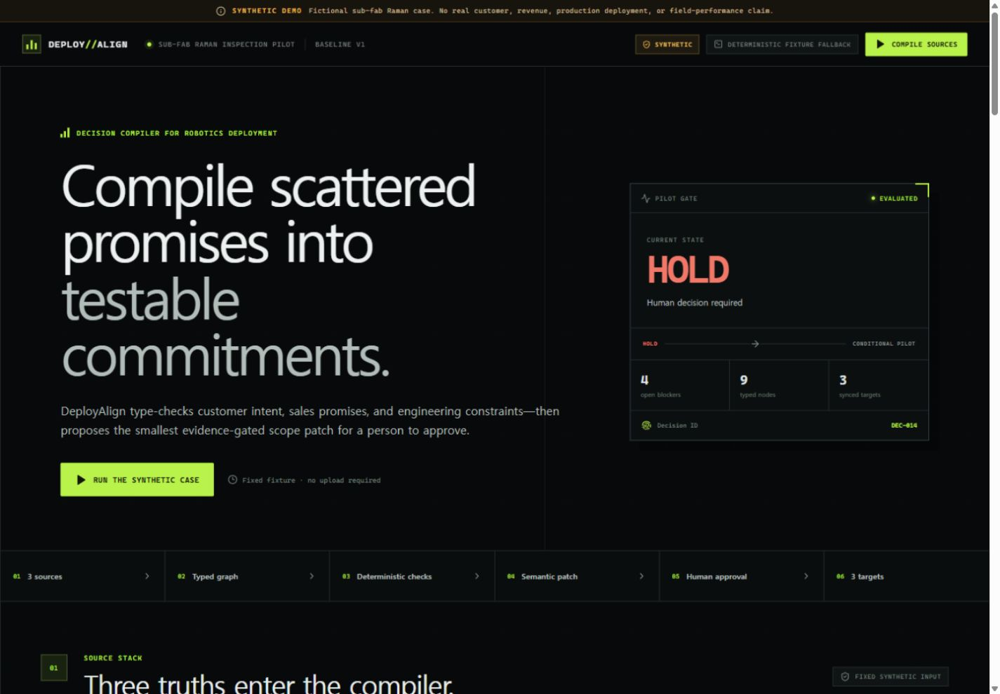
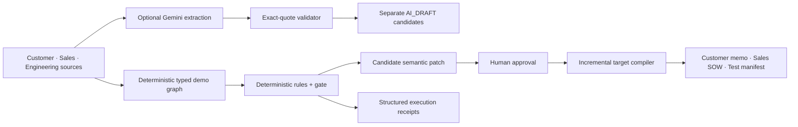
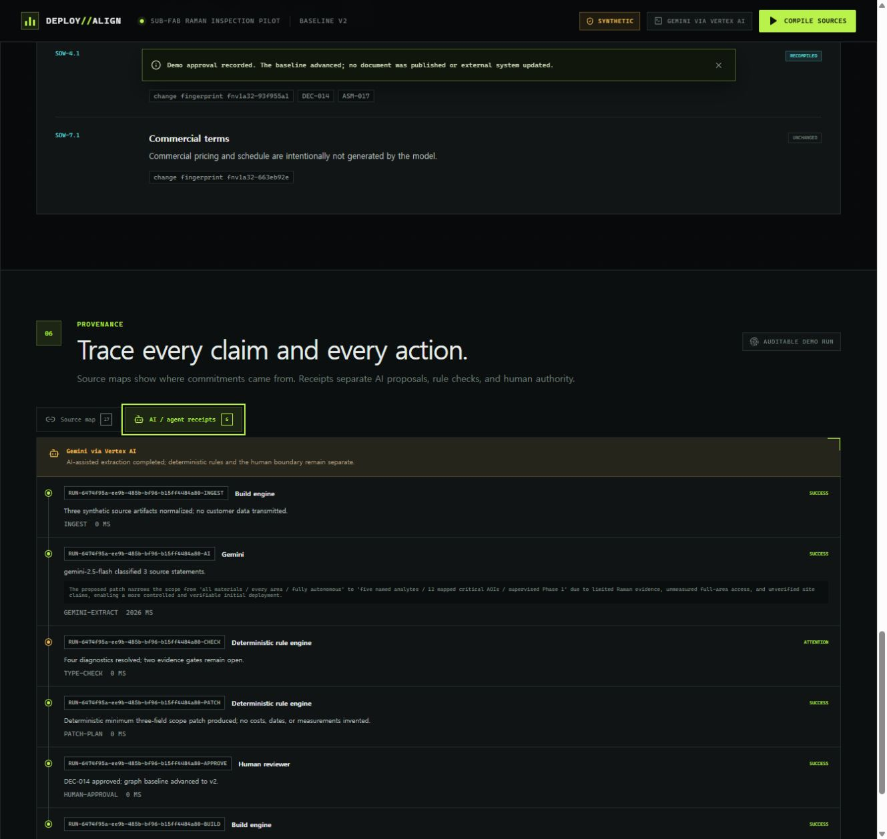

# DeployAlign

> Compile scattered promises into testable deployment commitments.



**Live demo:** [deployalign-1007800160926.asia-northeast3.run.app](https://deployalign-1007800160926.asia-northeast3.run.app) · **Demo video:** [youtu.be/QOPgHHAWOBA](https://youtu.be/QOPgHHAWOBA) · **Source:** [github.com/chquandogong/deployalign](https://github.com/chquandogong/deployalign)

**Submission status:** Devpost Project Details and Additional Info are saved; finalization is at **4/5 Draft**. The final terms acceptance and Submit action have not been performed. Before submission, the saved pre-existing-resources answer still needs an approved OSS-framework disclosure update, and the entrant must separately resolve public Git author name/email exposure and the residual Microsoft Mark voice redistribution uncertainty.

DeployAlign is an evidence-gated, typed decision compiler for bespoke robotics deployments. It turns a customer email, a draft sales proposal, and an engineering review into a source-mapped `Deployment Commitment Graph`, applies deterministic domain checks, proposes the smallest reviewable scope patch, and recompiles only the affected deliverable sections after human approval.

The included scenario is synthetic: a sub-fab Raman inspection pilot. It contains no customer records, confidential company data, real revenue, or measured field outcomes.

## Why this is different

Generic AI document tools can summarize or rewrite a proposal. DeployAlign keeps pre-agreement statements semantically distinct:

- `CustomerPreference` is not silently promoted to `EngineeringConstraint`.
- `SalesCommitment` cannot outrun accepted `Evidence` without a blocker.
- a verbal `SiteClaim` is not treated as a surveyed fact.
- an open `VerificationTest` prevents an unconditional deployment gate.
- all affected outputs share a stable Decision ID and source map.

Gemini is an optional, exact-quote candidate extractor. Its validated statements remain separate `AI_DRAFT` nodes. The fixed demo's canonical graph, TypeScript checks, gate transition, patch, and non-cryptographic FNV-1a32 section fingerprints are deterministic. A human must approve every scope-changing patch.

## Demo flow

1. Ingest three synthetic artifacts.
2. Compile atomic statements into typed nodes with source quotes.
3. Emit six domain diagnostics (`DA-001`–`DA-006`).
4. Review a three-field minimum scope patch:
   - all materials → five named analytes
   - every area → 12 mapped critical AOIs
   - fully autonomous → supervised Phase 1
5. Approve the patch as a human reviewer.
6. Advance `HOLD` → `CONDITIONAL PILOT` while critical tests remain open.
7. Recompile six affected sections and preserve three unrelated FNV-1a32 fingerprints.

## Architecture



The current public demo is Cloud Run revision `deployalign-00004-wgb` in `asia-northeast3`, serving 100% of traffic with Vertex AI enabled and a one-instance ceiling. Its health endpoint returned `ok=true`, `service=deployalign`, and `liveGemini=true`. A prior deployed compile—not the health response alone—verified live `gemini-2.5-flash` extraction, approval-token provenance, and Cloud Logging receipts. Gemini contributes only validated exact-quote `AI_DRAFT` candidates and a rationale sidecar; deterministic TypeScript rules remain authoritative for the canonical graph, diagnostics, gate, patch, and target outputs. When model access is unavailable, the UI reports the failure instead of presenting it as a successful live call.

The deployed footer links to [the 3,462-byte third-party license notice](https://deployalign-1007800160926.asia-northeast3.run.app/third-party-licenses.txt), verified HTTP 200. It includes the full React/React DOM/Scheduler MIT, Vite browser-bundle MIT, and Lucide ISC license texts.




## Run locally

Requirements: Node.js 24+, pnpm 11+.

```bash
pnpm install
pnpm dev
```

Open `http://localhost:5173`. The API listens on port `8080`.

### Enable a live Gemini call

Copy `.env.example` to `.env`, set `ALLOW_LIVE_GEMINI=true`, then choose one server-side authentication path:

- Gemini Developer API: set `GEMINI_API_KEY`.
- Vertex AI: set `GOOGLE_CLOUD_PROJECT` and `GOOGLE_CLOUD_LOCATION`, and provide Application Default Credentials.

Never expose the key in client-side `VITE_*` variables.

## Quality gates

```bash
pnpm typecheck
pnpm lint
pnpm test
pnpm build
```

The 13 deterministic tests verify blocker determinism, source-map grounding, strict fixture isolation, patch minimality, the human approval boundary, conditional gate safety, selective recompilation, preserved FNV-1a32 fingerprints, and stable Decision IDs.

## Container

```bash
docker build -t deployalign .
docker run --rm -p 8080:8080 deployalign
```

The current public prototype was built by Cloud Build and deployed to Cloud Run with `ALLOW_LIVE_GEMINI=true`, a dedicated runtime service account, and a shared `COMPILE_TOKEN_SECRET` of at least 32 bytes supplied through Secret Manager. It is capped at one instance because the demo request limiter is process-local. The service intentionally refuses to start in production without the stable secret. The live URL, Vertex model call, approval flow, and structured Cloud Logging entries are verified; current billing totals are not claimed because usage reporting can lag.

## Safety boundaries

- Generated SOWs are drafts until a human approves the semantic patch.
- Gemini cannot invent measurements, cost, schedule, physical feasibility, or safety certification.
- The demo does not control a robot and does not certify chemical detection or facility access.
- Source quotes returned by Gemini must match the supplied artifact exactly or are rejected.
- Live model calls are disabled unless `ALLOW_LIVE_GEMINI=true`.

## Documentation

- Project status: [`docs/00-overview/DASHBOARD.md`](docs/00-overview/DASHBOARD.md)
- Product specification: [`docs/03-spec/SPEC.md`](docs/03-spec/SPEC.md)
- Architecture: [`docs/03-spec/ARCHITECTURE.md`](docs/03-spec/ARCHITECTURE.md)
- Test plan: [`docs/04-quality/TEST_PLAN.md`](docs/04-quality/TEST_PLAN.md)
- Submission evidence status: [`docs/submission/EVIDENCE_CHECKLIST.md`](docs/submission/EVIDENCE_CHECKLIST.md)

## License

DeployAlign is MIT-licensed; see [`LICENSE`](LICENSE). Browser-bundle third-party notices are published at [`/third-party-licenses.txt`](https://deployalign-1007800160926.asia-northeast3.run.app/third-party-licenses.txt).
