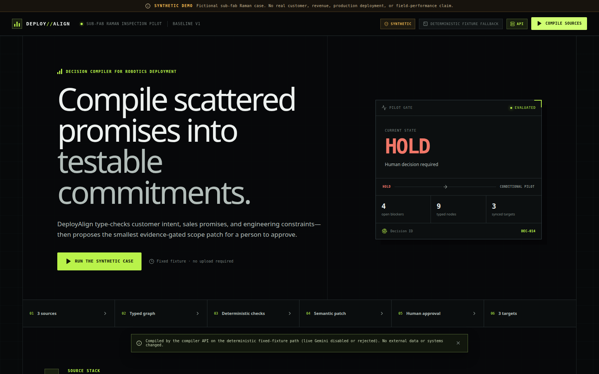
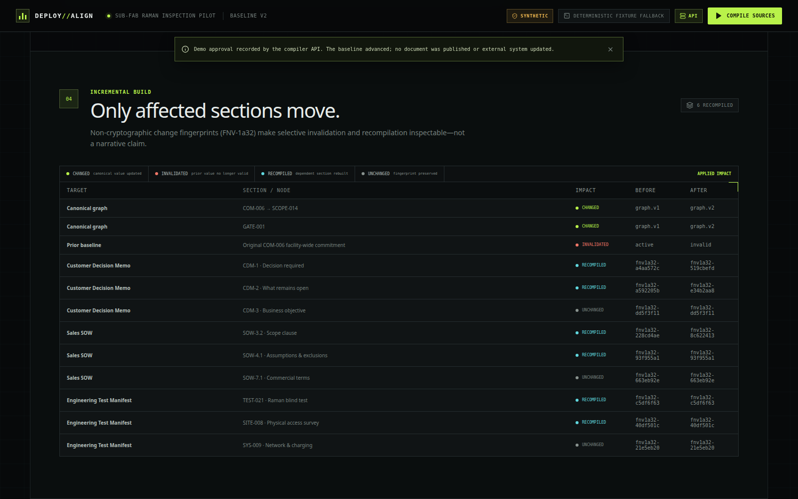
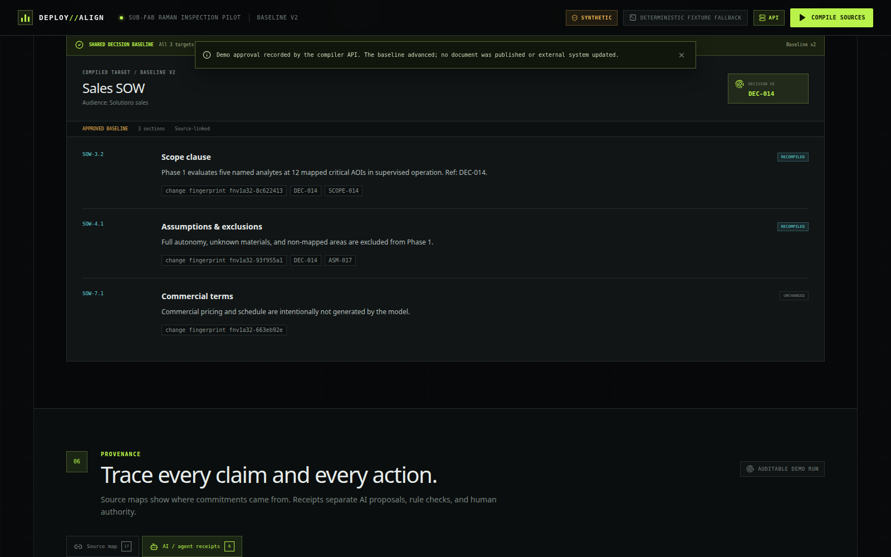
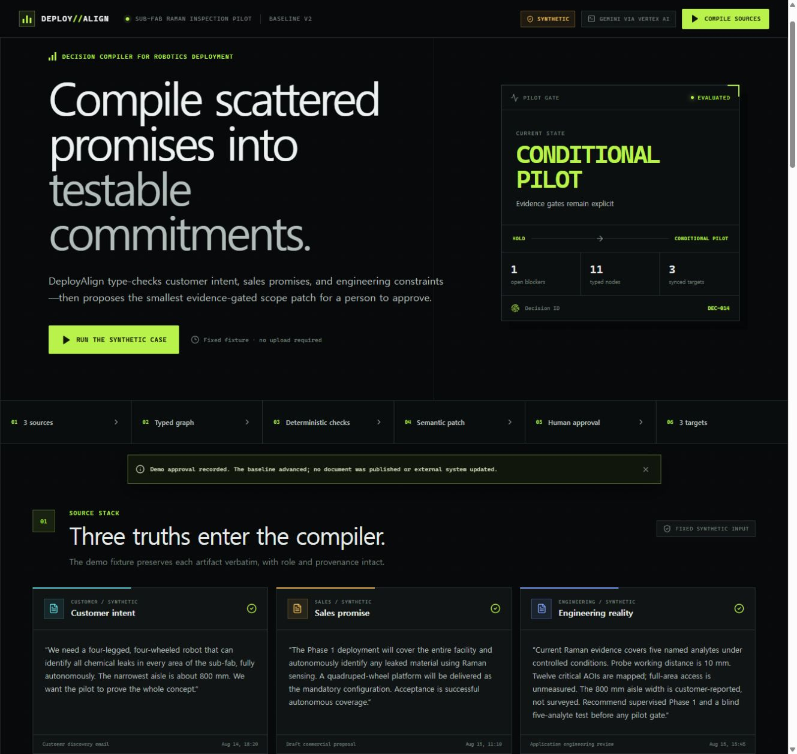
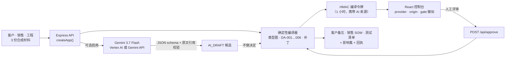

# DeployAlign

**把零散的部署承诺编译成可测试的承诺条款。**

[](https://github.com/chquandogong/deployalign/actions/workflows/ci.yml)
[](https://deployalign-1007800160926.asia-northeast3.run.app)
[](https://ai.google.dev/gemini-api/docs/models)
[](.nvmrc)
[](LICENSE)

🌐 [English](README.md) · [한국어](README.ko.md) · **[中文](README.zh.md)**

---



## 问题

一个定制化机器人部署项目，至少建立在三份彼此并不一致的文档之上。
客户写的是 *"全自主地识别所有区域内的所有化学泄漏"*。
销售把它变成 *"Phase 1 覆盖整个厂区"*。工程团队在之后、在另一份评审里写道：
*"当前证据只覆盖五种已命名的分析物；已映射 12 个关键区域；800 mm 的通道宽度是客户口述、
未经实测；建议 Phase 1 采用有人监督模式，并在任何试点闸门之前完成盲测。"*

没有人说谎。但等到工作说明书（SOW）签字时，*所有物质* 已经成了合同承诺，客户对四足平台的
*偏好* 已经成了 *强制配置*，未实测的通道宽度已经成了设计约束。部署工程师在现场才发现这些
偏差——而现场一小时的成本，高于整个评审的成本。

## DeployAlign 做什么

DeployAlign 像编译器处理源代码一样处理这些文档。它从语句中构建**带类型的承诺图**，运行附带
原文引用的**确定性诊断**，提出**证据所支持的最小范围补丁**，在**人工评审边界**处停下，然后
**只重新编译决策真正影响到的下游章节**——客户决策备忘、销售 SOW、工程测试清单——三者共享
同一个决策 ID。

```text
 3 份源材料 ──▶ 类型图 ──▶ 6 项诊断 ──▶ 三字段补丁 ──▶ 人工 ──▶ 3 份目标文档
 客户·销售·      11 种节点    DA-001…006    不臆造价格/     评审     备忘·SOW·
 工程            7 种边       原文引用      日期/数值        闸门     测试清单
```

内置场景是**合成的**：一个虚构的 sub-fab 拉曼检测试点。其中没有客户记录、没有机密数据、
没有收入、没有实测的现场结果，并且 UI 在每个页面上都明确标注这一点。

### 为什么是*类型系统*，而不是摘要

通用的 AI 文档工具做的是摘要或改写。DeployAlign 让协议前的各类语句**在语义上保持区分**，
使其中一种不会悄无声息地变成另一种：

| 文档中的表述 | 通常发生的事 | DeployAlign 的类型 |
| --- | --- | --- |
| "我们希望是四足机器人" | 变成 SOW 中的硬性要求 | `CustomerPreference` —— 若销售将其设为强制项，则告警 (`DA-003`) |
| "覆盖整个厂区、任何物质" | 变成验收标准 | 与 `EngineeringConstraint` 形成 `CONFLICTS_WITH` 的 `SalesCommitment` —— 阻断项 `DA-001`、`DA-002` |
| "最窄通道大约 800 mm" | 变成设计约束 | `SiteClaim`，实测前状态为 `OPEN` —— 告警 `DA-004` |
| "验收标准是成功的自主覆盖" | 原样签署 | 阻断项 `DA-005` —— 不是客观、可重复的标准 |
| "任何试点闸门前完成五种分析物盲测" | 启动会后被遗忘 | 通过 `REQUIRES_TEST` 连接 `DeploymentGate` 的 `VerificationTest` —— 阻断项 `DA-006` 使闸门保持条件状态 |

DeployAlign 提出的补丁刻意保持"无趣"：*所有物质 → 五种已命名分析物*，*所有区域 → 12 个已映射
关键 AOI*，*全自主 → 有人监督的 Phase 1*。每个值都复制自工程证据。不臆造任何东西——没有价格、
没有排期、没有阈值。

### AI 在哪里，不在哪里

Gemini 是一个**可选的、基于原文引用的抽取前端**。启用时，它返回经过 schema 校验的候选语句，
且必须逐字引用原文；任何缺乏依据、类型错误或超出范围的内容都会被拒绝，编译器则在没有它的
情况下继续。候选项以独立的 `AI_DRAFT` 节点呈现。**图、六项诊断、闸门、补丁和目标文档都是
确定性的 TypeScript**，并且每个改变范围的补丁都必须由人批准。回执（receipt）记录了每个参与者
各做了什么——Gemini、规则引擎、人工评审者、构建引擎。

从 0.2.0 起，每个结果还带有**执行来源（execution origin）**：由编译器服务产生的标为 `API`，
因 API 不可达而由页面本地计算的标为 `IN-BROWSER`。回退结果再也无法被误认为服务端运行。

## 三分钟看懂

- 🎬 **演示视频：** [youtu.be/QOPgHHAWOBA](https://youtu.be/QOPgHHAWOBA) —— 2026-08-17 的演示（0.1.0）。0.2.0 演示的脚本见 [`docs/submission/DEMO_SCRIPT.md`](docs/submission/DEMO_SCRIPT.md)，并用其中描述的可复现流水线构建。
- 🌐 **在线演示：** [deployalign-1007800160926.asia-northeast3.run.app](https://deployalign-1007800160926.asia-northeast3.run.app) —— **0.1.0 构建**的公开 Cloud Run 部署，通过 Vertex AI 启用了实时 Gemini 抽取（单实例，每客户端每十分钟六次编译）。重新部署 0.2.0 由决策 D-017 跟踪。

点击 **Run the synthetic case**，阅读六项诊断，打开补丁，按下 **Simulate approval & recompile**，
然后对照影响表：六个章节被重建，三个未受影响的章节保留其变更指纹。





2026-08-17 验证的、带有真实 Gemini 回执的 0.1.0 在线部署：



## 在你自己的文档上运行（本地模式，0.3）

公开演示只编译合成夹具——这是无认证端点的安全边界。在本地，一个标志即可为你自己的三份文档
打开**通用编译路径**：

```bash
ALLOW_CUSTOM_ARTIFACTS=true pnpm dev
```

首屏会出现 **Use your own documents** 按钮。粘贴一份客户备忘、一份销售提案和一份工程评审；
编译器把它们拆成逐字的子句，用角色感知的词法规则为每个子句定类型，把 `DA-001`–`DA-006` 作为
检测器运行，并提出一个补丁——其中**每个替换值都复制自某条工程语句**；如果工程文本没有给出
有界的数量，就不提出补丁，并在理由中说明。评审、批准，然后把结果导出为 Markdown 或 JSON。


诚实的预期：

- 检测器是**英文词法启发式规则**。它们为评审者找出候选项并引用来源；它们不做决定，也会漏掉规则未覆盖的表述。韩文及其他语言在路线图上。
- 即使没有任何发现，闸门在有人评审之前也保持 `HOLD`，并且永远不会变成无条件的 `PASS`。
- 你的文本只留在你自己的 API 进程中。**只有**当该进程同时以 `ALLOW_LIVE_GEMINI=true` 运行时才会发送给 Gemini；切勿在公开部署上同时开启两者。

## 架构



| 层 | 位置 | 职责 |
| --- | --- | --- |
| 领域 | `src/domain/` | 类型、规范夹具编译器（14 个测试）、frozen 合成夹具，以及 `general/`——子句抽取、词法定型、检测器、基于证据的补丁、通用目标文档（15 个测试） |
| API | `server/app.ts`、`server/index.ts` | 输入边界、夹具守卫/自定义模式、限流、绑定模式+补丁+材料哈希的 HMAC 令牌、`/api/health`、`/api/compile`、`/api/approve`、静态构建；18 个契约测试 |
| 模型适配器 | `server/gemini.ts` | 可选 Gemini 调用、提示词、`thinkingConfigFor`、纯函数 `validateGeminiPayload`；11 个测试 |
| UI | `src/App.tsx`、`src/components/ArtifactEditor.tsx`、`src/lib/exportMarkdown.ts` | 源材料、文档编辑器（自定义模式）、图 + 节点检视器、诊断、补丁 diff、批准边界、影响表、带 Markdown/JSON 导出的目标文档、源映射、回执 |

详见：[`docs/03-spec/ARCHITECTURE.md`](docs/03-spec/ARCHITECTURE.md) ·
[`docs/03-spec/SPEC.md`](docs/03-spec/SPEC.md)。

## 快速开始

要求：Node.js 24（[`.nvmrc`](.nvmrc)；≥ 22.13 亦可）以及通过 Corepack 使用的 pnpm 11。

```bash
git clone https://github.com/chquandogong/deployalign.git
cd deployalign
corepack enable
pnpm install --frozen-lockfile
pnpm dev
```

打开 <http://localhost:5173>。Vite 将 `/api` 代理到 `:8080` 上的 Express 服务器。
不需要任何凭据：没有模型密钥时，编译器走确定性路径，UI 标注为
`Deterministic fixture fallback · API`。

以生产方式运行构建产物：

```bash
pnpm build
COMPILE_TOKEN_SECRET="$(openssl rand -base64 48)" NODE_ENV=production pnpm start
# → http://localhost:8080  ·  GET /api/health → {"ok":true,"version":"0.2.0","model":"gemini-3.7-flash",…}
```

### 启用实时 Gemini 调用

将 `.env.example` 复制为 `.env`，设置 `ALLOW_LIVE_GEMINI=true`，并选择**一条**服务端凭据路径。
绝不要把密钥放进客户端的 `VITE_*` 变量。

| 变量 | 默认值 | 用途 |
| --- | --- | --- |
| `ALLOW_LIVE_GEMINI` | `false` | 显式启用模型调用；公开演示不能悄悄消耗配额 |
| `ALLOW_CUSTOM_ARTIFACTS` | `false` | 本地模式：通过通用编译器接受你自己的三份文档。公开部署上保持关闭 |
| `GEMINI_API_KEY` | — | 路径 A：Gemini Developer API |
| `GOOGLE_CLOUD_PROJECT` / `GOOGLE_CLOUD_LOCATION` | — / `global` | 路径 B：使用 Application Default Credentials 的 Vertex AI。Gemini 3.x 请保持 `global` |
| `GEMINI_MODEL` | `gemini-3.7-flash` | 固定任意模型。Gemini 2.5 Flash 已列入 Vertex AI 退役计划（2026-10-16） |
| `GEMINI_THINKING_LEVEL` | `low` | 仅 Gemini 3：`low` / `medium` / `high`；固定 2.5 时 thinking 保持关闭 |
| `COMPILE_TOKEN_SECRET` | 每进程随机（开发） | ≥ 32 字节，**生产环境必需**，跨实例共享 |
| `PORT` | `8080` | API/静态文件端口 |

> `.env.example` 中仍保留着 0.1.0 时期的 `GEMINI_MODEL=gemini-2.5-flash`——请删除或更新
> 那一行，否则该固定值会覆盖新的默认值。

## 质量门

```bash
pnpm typecheck   # tsc -b
pnpm lint        # oxlint
pnpm test        # vitest —— 5 个套件、60 个测试
pnpm build       # vite 生产构建
```

CI 在每次 push 和 pull request 上以 Node 24 运行同样的四步，外加一次容器镜像构建
（[`.github/workflows/ci.yml`](.github/workflows/ci.yml)，actions 以 SHA 固定）。这些测试
保护着让工具可信的契约：每条引用都是其材料的子串，闸门永不到达无条件通过，补丁恰好三个字段，
无关章节保留指纹，被篡改的令牌被拒绝，非夹具输入永不到达模型。

## 容器与部署

```bash
docker build -t deployalign .
docker run --rm -p 8080:8080 -e COMPILE_TOKEN_SECRET="$(openssl rand -base64 48)" deployalign
```

公开演示在 Cloud Run（`asia-northeast3`，1 CPU / 512 MiB，最小 0 / 最大 1 实例）上运行此镜像，
使用专用运行时服务账号、存放于 Secret Manager 的令牌密钥，并启用 Vertex AI。由于限流器和评审
状态都在进程内，实例数被限制为 1——这是有意为之的原型边界，而非可扩展性声明。运维、验证步骤和
模型迁移流程见 [`docs/05-ops/RUNBOOK.md`](docs/05-ops/RUNBOOK.md)。

## 安全边界

- 生成的文档在人批准语义补丁之前都是**草稿**；演示中的批准按钮只是展示这个边界，不是经过身份验证的批准。
- Gemini **不能臆造**测量值、成本、排期、物理可行性或安全认证，也不能推进闸门。
- 模型返回的原文引用必须与材料**完全一致**，否则被拒绝。
- 公开原型**只编译公开的合成夹具**；数量、元数据或内容的任何改动都会在调用模型之前被拒绝。自定义模式是仅限本地的标志，公开演示从不启用。
- 编译令牌是签名的而非加密的；限流在内存中；指纹是 `fnv1a32` 变更检测器而非完整性哈希。见 [`SECURITY.md`](SECURITY.md) 与 [`docs/04-quality/RISK_REGISTER.md`](docs/04-quality/RISK_REGISTER.md)。
- DeployAlign 不控制机器人，也不认证化学检测或设施准入。

## 路线图 —— 朝着真正有人用的工具

机制已在一个合成案例上得到证明。"有用"意味着一名部署工程师可以在**自己的**三份文档上运行它，
并依据结果行动。带有成功与停止标准的后续步骤见 [`docs/00-overview/ROADMAP.md`](docs/00-overview/ROADMAP.md)：

1. ~~**0.3 —— 使用自己的材料（本地模式）。**~~ 已在 0.3.0 发布：确定性通用编译器、六个检测器、逐字证据补丁、Markdown/JSON 导出、仅限本地的标志（D-016）。
2. **0.4 —— CLI 与 CI 模式。** `deployalign compile ./artifacts --fail-on blocker`，让超出证据的 SOW 修改使文档流水线失败——驱动它的通用编译器现已存在。
3. **0.5 —— 从业者试点。** 五次访谈、脱敏样本、实测精度与决策耗时——只有这些才能决定身份、持久化与审计是否值得构建。

欢迎 issue 与 pull request；见 [`CONTRIBUTING.md`](CONTRIBUTING.md)。

## 项目状态与起源

DeployAlign 为 **Build with Gemini XPRIZE** 而构建，并于 2026-08-17 提交
（[Devpost 条目](https://devpost.com/software/test-q0h69v)）。那次提交是一个检查点（`v0.1.0`），
不是终点。项目在公开环境中继续推进；变更记录在 [`CHANGELOG.md`](CHANGELOG.md)，背后的理由记录在
[`docs/02-decisions/DECISION_LOG.md`](docs/02-decisions/DECISION_LOG.md)。

截至 0.3.0 的诚实范围：确定性编译器（夹具与通用）、API、UI 与 60 个测试已实现并在本地验证，自定义文档流程也经过了无头浏览器验证；实时 `gemini-2.5-flash`
调用已在已部署的 0.1.0 版本上验证；`gemini-3.7-flash` 默认值已通过单元测试，等待第一份实时回执；
没有生产部署、没有客户、没有实测的现场结果。这里的一切都不构成参赛资格、奖项或商业可行性的证明。

## 文档

| 文档 | 目的 |
| --- | --- |
| [`docs/00-overview/DASHBOARD.md`](docs/00-overview/DASHBOARD.md) | 当前状态、工作板、等待所有者决策的事项 |
| [`docs/00-overview/ROADMAP.md`](docs/00-overview/ROADMAP.md) | "有用"的定义及通往它的阶段 |
| [`docs/03-spec/SPEC.md`](docs/03-spec/SPEC.md) | 功能需求 FR-01…FR-28 与验收标准 |
| [`docs/03-spec/ARCHITECTURE.md`](docs/03-spec/ARCHITECTURE.md) | 组件、数据流、信任边界、失效模式 |
| [`docs/04-quality/TEST_PLAN.md`](docs/04-quality/TEST_PLAN.md) · [`RISK_REGISTER.md`](docs/04-quality/RISK_REGISTER.md) | 测试计划与带状态的风险 |
| [`docs/05-ops/RUNBOOK.md`](docs/05-ops/RUNBOOK.md) | 运行、验证、迁移模型、排障、回滚 |
| [`docs/02-decisions/DECISION_LOG.md`](docs/02-decisions/DECISION_LOG.md) | D-001…D-016 与所有者决策队列 |
| [`docs/submission/`](docs/submission/) | 演示脚本、YouTube 元数据，以及 Devpost 证据的历史记录 |

## 许可证

MIT —— 见 [`LICENSE`](LICENSE)。浏览器包的第三方声明发布于
[`/third-party-licenses.txt`](https://deployalign-1007800160926.asia-northeast3.run.app/third-party-licenses.txt)。
