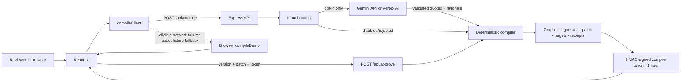

# DeployAlign Architecture

> Status: Prototype architecture; not production-approved · Date: 2026-08-17 · Owner: Engineering

## Context and boundaries

DeployAlign is a React/TypeScript single-page application served with an Express API. It demonstrates one synthetic project. The public Cloud Run demo has no database, authentication, queue, or durable audit log and is not a customer production system.

External dependencies are the browser, Gemini Developer API or Vertex AI, and Cloud Run. On 2026-08-17, revision `deployalign-00003-tlc` was verified at `https://deployalign-1007800160926.asia-northeast3.run.app` in project `project-55fbcfd2-0ad6-4c99-a25`, region `asia-northeast3`. The deployed service uses Vertex AI model `gemini-2.5-flash`, runtime identity `deployalign-runner@project-55fbcfd2-0ad6-4c99-a25.iam.gserviceaccount.com`, and a stable Secret Manager HMAC secret.

## Components and responsibilities

| Component | Responsibility | Current boundary |
| --- | --- | --- |
| React UI | Present sources, graph, diagnostics, patch, targets, impact, and receipts | Result-driven responsive UI passed local and deployed live-browser QA |
| `compileClient` | Call compile/review endpoints with a 60-second timeout | Local fallback only for a network `TypeError`, exact fixture, and compatible review state |
| Express API | Validate inputs, rate-limit compile, issue/verify provenance tokens, expose health/compile/review, serve static build | In-memory, unauthenticated, single-process demo |
| Gemini adapter | Classify exact source quotes and propose a concise patch rationale | Opt-in; deployed Vertex path verified with exactly three validated `AI_DRAFT` candidates; never builds the canonical graph/gates/targets |
| Deterministic compiler | Build graph, diagnostics, patch, targets, impact, FNV-1a32 fingerprints, and receipts | Six `DEC-014`-linked sections rebuild; three unrelated baseline sections are reused within the approved compile; fingerprints detect change, not cryptographic integrity |
| Unit tests | Protect grounding, strict fixture identity/schema, gates, AI candidates, patch size, response isolation, rebuild behavior, and decision IDs | Thirteen cases; final run passed 13/13 |

## Data flow

The deployed path uses Cloud Run with unauthenticated access, min instances 0/max 1, 1 CPU/512 MiB, 60-second timeout, and concurrency 20. Max instances 1 preserves the prototype's process-local assumptions; it is not a scalability claim.

## Trust boundaries and permissions

- Browser to API is an untrusted boundary; there is no user identity or CSRF/session model.
- API to Gemini is an external data boundary. Only synthetic data should cross it now.
- Environment credentials are secret and must never enter the client, repository, logs, screenshots, or submission text.
- The demo review endpoint checks a known version/patch and verifies an HMAC-SHA256 compile token. The token preserves validated AI provenance and expiry, but its base64url payload is signed rather than encrypted. It is not user authorization, organizational approval, or non-repudiation.
- Devpost final submission and material video/deployment changes are external-write gates requiring human review. The repository, public synthetic demo, and public video have already been published.

## State and storage

- Source of truth for the prototype: TypeScript code and bundled synthetic data.
- Client state: in-memory per browser session.
- Server rate-limit attempts: in-memory map, reset on restart.
- Gemini extraction evidence: returned in the compile response and carried through review in a one-hour HMAC token; it is not persisted by the server.
- Token secret: `COMPILE_TOKEN_SECRET` when configured; local development otherwise uses a random per-process secret. Production refuses to start without a value of at least 32 bytes.
- Generated targets: returned in the response only; not persisted. Each compile builds a fresh baseline target graph. During an approved compile, six Decision-ID-linked sections are replaced with rebuilt objects while three unrelated canonical baseline section objects are reused within that response; one response cannot mutate a later compile.
- Section values prefixed `fnv1a32-` are 32-bit FNV-1a change fingerprints. They are not cryptographic integrity hashes or a durable ledger.
- Live verification: `gemini-2.5-flash` classified exactly three source statements, the UI displayed a successful Gemini receipt, and the signed token retained that provider/candidate provenance after the demo review. Redacted logs recorded `compile_completed` (version 1, six unresolved diagnostics) and `patch_approved` (version 2).

## Failure modes and recovery

| Failure | Current behavior | Recovery/required improvement |
| --- | --- | --- |
| Gemini disabled or unconfigured | Deterministic demo result | Display fallback clearly; configure only with approval |
| Gemini validation fails | Log rejection; continue deterministically | Capture redacted metrics and improve prompt/validator |
| Demo receipts | Actors follow the actual path, but IDs repeat by demo version and deterministic durations are zero | Treat as illustrative receipts; use unique durable audit events in production |
| API network failure | Exact fixture may compile locally with the same provider value as server-side deterministic execution | Add an explicit execution-origin field/banner and retain error context |
| Compile abuse | Six attempts per ten minutes per observed IP | Use managed rate limiting and identity in production |
| Server restart | Rate state resets; tokens issued with an ephemeral default secret become invalid | Configure an approved shared secret and durable controls if validated |
| Compile token mismatch/expiry | Review returns 409 without changing the demo baseline | Recompile and review the new result; never bypass verification |
| Local restart or instances with different secrets | A valid token from one process cannot be verified by another | Production must use the same ≥32-byte secret from approved secret management; keep the demo at max instances 1 while other state remains process-local |
| Review replay | A still-valid token can be reused within its one-hour window | Add identity, nonce/idempotency, and durable audit state for production |
| Invalid real-world decision | No true safety controls | Keep prototype synthetic; require domain governance |

## Scale changes beyond the envelope

- More documents require document parsing, chunk/source coordinates, search, and configurable schemas.
- More users require authentication, tenancy, quotas, durable jobs, and data lifecycle controls.
- Production review requires immutable audit events, role separation, signed approvals, and policy versioning.
- High-volume compilation requires queues, managed storage, observability, and provider cost controls.
- Multi-instance operation requires shared secret management plus shared rate limiting/operational state; the current unconfigured demo is limited to one instance.

These are extension points, not claims that the current prototype supports them.

## Open architecture decisions

- Production-grade Google Cloud hosting, monitoring, and model topology beyond the bounded demo.
- Region, retention, encryption, and customer-data policy.
- Identity and approval-signature model.
- Tenant-scoped persistence and event model.
- Compile-token key rotation and multi-instance secret distribution.
- Configurable rule/policy format and versioning.
- Whether browser fallback should be removed outside demo mode.
