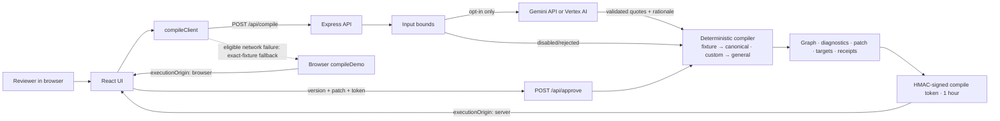

# DeployAlign Architecture

> Status: Prototype architecture 0.6.1; not production-approved · Date: 2026-09-02 · Owner: Engineering

## Context and boundaries

DeployAlign is a React/TypeScript single-page application served with an Express API. It demonstrates one synthetic project. The public Cloud Run demo has no database, authentication, queue, or durable audit log and is not a customer production system.

External dependencies are the browser, Gemini Developer API or Vertex AI, and Cloud Run. On 2026-09-02, revision `deployalign-00006-h5c` (0.6.1 tree, D-024) replaced `deployalign-00005-9vs` (tag `v0.3.0`, 2026-08-26), which had replaced `deployalign-00004-wgb`; it serves 100% of traffic at `https://deployalign-1007800160926.asia-northeast3.run.app` in project `project-55fbcfd2-0ad6-4c99-a25`, region `asia-northeast3`. The deployed service uses Vertex AI model `gemini-3.7-flash` (location `global`), runtime identity `deployalign-runner@project-55fbcfd2-0ad6-4c99-a25.iam.gserviceaccount.com`, and a stable Secret Manager HMAC secret. Health returned `ok=true`, `service=deployalign`, and `liveGemini=true`; the footer's third-party notice returned HTTP 200/3,462 bytes with the full applicable browser-bundle license texts.

## Components and responsibilities

| Component | Responsibility | Current boundary |
| --- | --- | --- |
| React UI | Present sources, graph, diagnostics, patch, targets, impact, and receipts; in local mode, an artifact editor whose 'Load an example' row (0.6.0) appears only when the API advertises custom mode (`/api/health` `customArtifacts: true`) | Result-driven responsive UI passed local and deployed live-browser QA; the public demo never shows the editor |
| `compileClient` | Call compile/review endpoints with a 60-second timeout | Local fallback only for a network `TypeError`, exact fixture, and compatible review state; fallback results are labelled `executionOrigin: 'browser'` |
| Express API (`createApp` in `server/app.ts`) | Validate inputs, rate-limit compile, issue/verify provenance tokens, expose health/compile/review, serve static build, label results `executionOrigin: 'server'` | In-memory, unauthenticated, single-process demo; factory takes secret/mode/dist/live-model/logger so tests run isolated instances; `server/index.ts` only listens |
| Gemini adapter (`server/gemini.ts`) | Classify exact source quotes and propose a concise patch rationale | Opt-in; default model `gemini-3.7-flash` with `thinkingLevel: LOW` (Gemini 2.5 pins keep `thinkingBudget: 0`); pure `validateGeminiPayload` enforces quotes/types/confidence/coverage/rationale; live-verified on `gemini-2.5-flash` (0.1.0, 2026-08-17) and on `gemini-3.7-flash` (`deployalign-00005-9vs` 2026-08-26, `deployalign-00006-h5c` 2026-09-02); never builds the canonical graph/gates/targets |
| Deterministic compiler (fixture) | Build graph, diagnostics, patch, targets, impact, FNV-1a32 fingerprints, and receipts for the synthetic case | Six `DEC-014`-linked sections rebuild; three unrelated baseline sections are reused within the approved compile; fingerprints detect change, not cryptographic integrity |
| GitHub Action (`action.yml`, 0.5.0) | Composite: setup Node → `pnpm install --prod` in the action path → run the CLI → parse `result.json` into outputs → job summary | Same deterministic path as the CLI; self-tested in CI on `examples/` |
| CLI (`bin/deployalign.mjs` → `cli/main.ts`, 0.4.0) | Load three documents (dir / flags / JSON), run the general or fixture compiler with `executionOrigin: cli`, write outputs, map unresolved diagnostics to exit codes | Deterministic only; no model, no network; tsx-backed so no build step |
| General compiler (`src/domain/general/`, 0.3.0) | `extractStatements` → `classifyStatements` → `detect` → `compileGeneral`: verbatim clauses, role-aware lexical typing, DA-001–DA-006 as detectors, patch values copied from engineering clauses, generic targets | Local custom mode only; English lexical heuristics; same incremental-rebuild mechanics via the shared `fingerprint.ts` |
| Example presets (`src/domain/examples.ts`, 0.6.0) | Bundled example presets (EN fail / EN pass / KO fail) used by the local-mode editor | `src/domain/examples.test.ts` asserts it mirrors `examples/` byte-for-byte and compiles to the documented verdicts; synthetic content only |
| Automated tests | Protect grounding, strict fixture identity/schema, gates, AI candidates, patch size, response isolation, rebuild behavior, decision IDs, execution origin, Gemini payload validation and the HTTP contract | 78 cases in eight files (14 fixture compiler, 15 general compiler, 9 corpora, 3 example presets, 2 Markdown export, 6 CLI, 11 Gemini validation, 18 API); passed 78/78 on 2026-09-02 |

## Data flow

The deployed path uses Cloud Run with unauthenticated access, min instances 0/max 1, 1 CPU/512 MiB, 60-second timeout, and concurrency 20. Max instances 1 preserves the prototype's process-local assumptions; it is not a scalability claim.

## Trust boundaries and permissions

- Browser to API is an untrusted boundary; there is no user identity or CSRF/session model.
- API to Gemini is an external data boundary. Only synthetic data crosses it unless the operator sets **both** `ALLOW_LIVE_GEMINI=true` and `ALLOW_CUSTOM_ARTIFACTS=true` on the same process — a deliberate local-only combination (R-23). The prompt marks custom text as untrusted data.
- Environment credentials are secret and must never enter the client, repository, logs, screenshots, or submission text.
- The review endpoint verifies an HMAC-SHA256 compile token that now binds mode, patch id and a SHA-256 of the artifacts; custom review must resubmit identical artifacts because the server keeps no state. The token preserves validated AI provenance and expiry, but its base64url payload is signed rather than encrypted. It is not user authorization, organizational approval, or non-repudiation.
- Devpost submission and material video/deployment changes are external-write gates requiring human review. The 2026-08-17 submission was explicitly approved and completed; future material edits remain gated.

## State and storage

- Source of truth for the prototype: TypeScript code and bundled synthetic data.
- Client state: in-memory per browser session.
- Server rate-limit attempts: in-memory map, reset on restart.
- Gemini extraction evidence: returned in the compile response and carried through review in a one-hour HMAC token; it is not persisted by the server.
- Token secret: `COMPILE_TOKEN_SECRET` when configured; local development otherwise uses a random per-process secret. Production refuses to start without a value of at least 32 bytes.
- Generated targets: returned in the response only; not persisted. Each compile builds a fresh baseline target graph. During an approved compile, six Decision-ID-linked sections are replaced with rebuilt objects while three unrelated canonical baseline section objects are reused within that response; one response cannot mutate a later compile.
- Section values prefixed `fnv1a32-` are 32-bit FNV-1a change fingerprints. They are not cryptographic integrity hashes or a durable ledger.
- Execution origin: `compileDemo` defaults every result to `executionOrigin: 'browser'`; only `createApp` handlers pass `'server'`. The label is disclosure for the reviewer, not an integrity property — a client can fabricate it locally, which is why only token-bearing server results are authoritative.
- Live verification: `gemini-2.5-flash` classified exactly three source statements, the UI displayed a successful Gemini receipt, and the signed token retained that provider/candidate provenance after the demo review. Redacted logs recorded `compile_completed` (version 1, six unresolved diagnostics) and `patch_approved` (version 2).

## Failure modes and recovery

| Failure | Current behavior | Recovery/required improvement |
| --- | --- | --- |
| Gemini disabled or unconfigured | Deterministic demo result | Display fallback clearly; configure only with approval |
| Gemini validation fails | Log rejection; continue deterministically | Capture redacted metrics and improve prompt/validator |
| Demo receipts | Actors follow the actual path, but IDs repeat by demo version and deterministic durations are zero | Treat as illustrative receipts; use unique durable audit events in production |
| API network failure | Exact fixture compiles locally and is labelled `executionOrigin: 'browser'`; the UI shows an `IN-BROWSER` chip and an explicit notice | Done in 0.2.0 (D-014); retain error context in telemetry when a backend exists |
| Compile abuse | Six attempts per ten minutes per observed IP | Use managed rate limiting and identity in production |
| Server restart | Rate state resets; tokens issued with an ephemeral default secret become invalid | Configure an approved shared secret and durable controls if validated |
| Compile token mismatch/expiry | Review returns 409 without changing the demo baseline | Recompile and review the new result; never bypass verification |
| Local restart or instances with different secrets | A valid token from one process cannot be verified by another | Production must use the same ≥32-byte secret from approved secret management; keep the demo at max instances 1 while other state remains process-local |
| Review replay | A still-valid token can be reused within its one-hour window | Add identity, nonce/idempotency, and durable audit state for production |
| Invalid real-world decision | No true safety controls | Keep prototype synthetic; require domain governance |

## Scale changes beyond the envelope

- More documents require document parsing, chunk/source coordinates, search, and configurable schemas.
- More users require authentication, tenancy, quotas, durable jobs, and data lifecycle controls.
- Production review requires immutable audit events, role separation, signed approvals, and policy versioning.
- High-volume compilation requires queues, managed storage, observability, and provider cost controls.
- Multi-instance operation requires shared secret management plus shared rate limiting/operational state; the current unconfigured demo is limited to one instance.

These are extension points, not claims that the current prototype supports them.

## Open architecture decisions

- Production-grade Google Cloud hosting, monitoring, and model topology beyond the bounded demo.
- Region, retention, encryption, and customer-data policy.
- Identity and approval-signature model.
- Tenant-scoped persistence and event model.
- Compile-token key rotation and multi-instance secret distribution.
- Configurable rule/policy format and versioning.
- Whether browser fallback should be removed outside demo mode.
- 0.3 local mode for user-supplied artifacts (`ROADMAP.md`): where the fixture guard is relaxed, how the six diagnostics become general detectors, and what leaves the machine when Gemini is enabled (D-016).
- Live verification of `gemini-3.7-flash` on the Vertex `global` endpoint before the 2026-10-16 retirement of Gemini 2.5 Flash (D-017).
